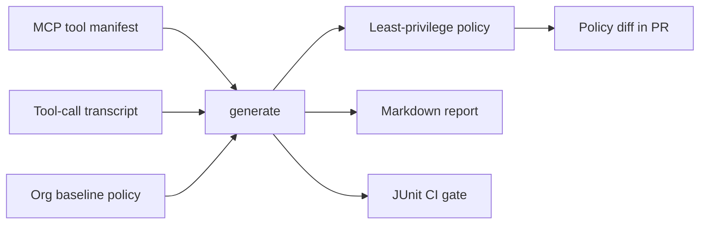

# mcp-policy-forge

`mcp-policy-forge` 是一个面向 AI / MCP / 安全 / 开发者工具场景的 least-privilege 权限策略生成与校验器。它读取 MCP server 工具清单、JSON schema、示例 transcript、repo 路径规则和组织策略，生成可读 Markdown、机器 JSON、CI JUnit，并提示高风险工具、路径越权、网络访问、写文件和命令执行风险。

项目目标不是替代人工安全评审，而是把 MCP 工具权限从“口头约定”变成可审计、可 diff、可接入 CI 的策略文件。



## 30 秒看懂价值

```bash
mcp-policy-forge generate \
  --manifest examples/manifest.json \
  --transcript examples/transcript.jsonl \
  --org-policy examples/org-policy.json \
  --repo-root . \
  --out-policy reports/policy.generated.json \
  --out-summary reports/summary.md \
  --out-md reports/report.md \
  --junit reports/junit.xml

mcp-policy-forge diff \
  --old examples/org-policy.json \
  --new reports/policy.generated.json \
  --out-md reports/policy-diff.md
```

典型 diff 会把新增能力直接暴露给 reviewer：

```text
Added rules
- allow repo.apply_patch actions=[write_file, read_file] paths=[src/app.py]
- allow shell.run actions=[execute_command, read_file] paths=[.]
- allow web.fetch actions=[network] networks=[docs.example.com]
```

这比“这个 MCP server 大概能读写仓库和联网”更适合安全评审：每个新增 action、路径和域名都能进入 PR diff 和 CI gate。完整展示见 [docs/showcase.md](docs/showcase.md)。

如果你在 GitHub Actions 里使用，可以把 `reports/summary.md` 追加到 `$GITHUB_STEP_SUMMARY`，或者用 `gh pr comment --body-file reports/summary.md` 发到 PR conversation。摘要会先给出 READY/REVIEW/BLOCK 决策、高风险工具和 findings，再把完整生成策略放进可展开的 `<details>`。

## 适合谁

- 正在发布 MCP server，需要最小权限策略和 CI gate 的开发者。
- 在 Claude Desktop、Codex、ChatGPT Apps SDK 或自研 MCP host 中接入工具调用的团队。
- 想在 PR 中 review “新增工具权限”而不只 review 代码 diff 的安全/平台团队。
- 需要把 transcript 中出现过的路径、网络域名和命令执行能力转成可审计证据的人。

## 功能

- 解析 MCP tool manifest，支持 `tools`、`mcpServers.*.tools` 等常见结构。
- 从 JSON schema 和工具描述推断 `read_file`、`write_file`、`network`、`execute_command`、`secret_access` 等 action。
- 从 JSON、JSONL 或文本 transcript 提取工具调用和参数中的路径、网络目标、权限需求。
- 合并 manifest、transcript 和组织基线策略，生成 least-privilege allow rules。
- 支持 allow / deny / path / network / action 规则，默认 deny，deny 优先。
- 检查 repo 根目录之外的路径访问。
- 风险评分并标记 low / medium / high / critical。
- 输出 JSON、Markdown、JUnit XML，适合本地审计和 CI。
- 提供 policy diff、policy validate、CI 退出码。
- 纯 Python 标准库实现，兼容 Python 3.9+，无外网依赖。

## 适用场景

- 为内部 MCP server 的工具能力生成初始权限策略。
- 在 PR 中比较策略变更，发现新增网络域名、写文件范围或命令执行能力。
- 在 Codex、ChatGPT Apps SDK、Claude Desktop、自研 MCP host 等集成环境中，对工具调用 transcript 做最小权限复盘。
- 为安全团队生成 Markdown 审计报告和 CI JUnit 报告。
- 作为组织 MCP 策略的“本地编译器”：开发者先生成，安全团队再收编发布。

## 安装

开发安装：

```bash
python -m pip install -e .
```

运行测试：

```bash
python -m unittest discover -s tests -v
```

安装后可使用命令：

```bash
mcp-policy-forge --help
python -m mcp_policy_forge --help
```

## 快速开始

使用示例输入生成 JSON、Markdown、JUnit 和 policy：

```bash
mcp-policy-forge generate \
  --manifest examples/manifest.json \
  --transcript examples/transcript.jsonl \
  --org-policy examples/org-policy.json \
  --repo-root . \
  --out-json reports/report.json \
  --out-policy reports/policy.generated.json \
  --out-md reports/report.md \
  --out-summary reports/summary.md \
  --junit reports/junit.xml \
  --fail-on never
```

CI 检查模式：

```bash
mcp-policy-forge check \
  --manifest examples/manifest.json \
  --transcript examples/transcript.jsonl \
  --org-policy examples/org-policy.json \
  --repo-root . \
  --junit reports/mcp-policy-junit.xml \
  --fail-on high
```

校验策略：

```bash
mcp-policy-forge validate --policy examples/org-policy.json
```

比较策略：

```bash
mcp-policy-forge diff \
  --old examples/org-policy.json \
  --new reports/policy.generated.json \
  --out-md reports/policy-diff.md
```

## CLI

### `generate`

从 manifest、transcript 和组织策略生成完整报告。

常用参数：

- `--manifest`: 必填，MCP tool manifest JSON。
- `--transcript`: 可选，示例调用 transcript，支持 JSON、JSONL、文本。
- `--org-policy`: 可选，组织基线策略。
- `--repo-root`: 可选，用于路径越权检查。
- `--out-json`: 输出完整机器报告。
- `--out-policy`: 输出生成后的 policy JSON。
- `--out-md`: 输出 Markdown 审计报告。
- `--out-summary`: 输出紧凑 Markdown，适合 GitHub Actions summary 或 PR 评论。
- `--junit`: 输出 JUnit XML。
- `--fail-on`: `never`、`violations`、`medium`、`high`、`critical`。

### `check`

和 `generate` 使用相同参数，但语义上用于 CI。退出码由 `--fail-on` 控制。

### `validate`

校验 policy JSON 的结构和基本规则。

### `diff`

比较两个 policy JSON，输出新增、删除、变更规则。

## 退出码

- `0`: 成功，且未触发失败阈值。
- `1`: 发现策略违规或风险达到 `--fail-on` 阈值。
- `2`: 输入文件不存在、JSON 无法解析、CLI 参数无效或 I/O 错误。

## 输入格式

### MCP manifest

支持常见 MCP tools 清单：

```json
{
  "tools": [
    {
      "name": "repo.read_file",
      "description": "Read a file from the repository workspace",
      "inputSchema": {
        "type": "object",
        "properties": {
          "path": { "type": "string", "examples": ["README.md"] }
        }
      }
    }
  ]
}
```

也支持：

```json
{
  "mcpServers": {
    "repo": {
      "tools": [
        { "name": "repo.read_file", "description": "Read file" }
      ]
    }
  }
}
```

### Transcript

支持 JSONL：

```json
{"type":"tool_call","name":"repo.read_file","arguments":{"path":"README.md"}}
{"type":"tool_call","name":"web.fetch","arguments":{"url":"https://docs.example.com"}}
```

也支持 OpenAI-style function/tool calls：

```json
{
  "tool_calls": [
    {
      "function": {
        "name": "repo.read_file",
        "arguments": "{\"path\":\"README.md\"}"
      }
    }
  ]
}
```

### 组织策略

```json
{
  "version": "2026-06",
  "defaults": { "effect": "deny" },
  "rules": [
    {
      "effect": "allow",
      "tools": ["web.fetch"],
      "actions": ["network"],
      "networks": ["docs.example.com"],
      "reason": "Allow documentation fetches"
    },
    {
      "effect": "deny",
      "tools": ["shell.*"],
      "actions": ["secret_access"],
      "reason": "Shell tools must not receive raw secrets"
    }
  ]
}
```

## 策略模型

顶层 policy：

- `version`: 策略版本字符串。
- `defaults.effect`: 默认行为，建议为 `deny`。
- `metadata`: 任意元数据。
- `rules`: 规则列表。

规则字段：

- `effect`: `allow` 或 `deny`。
- `tools`: 工具名或 glob，例如 `repo.*`。
- `actions`: action 列表，例如 `read_file`、`write_file`、`network`、`execute_command`、`secret_access`。
- `paths`: 路径 glob，例如 `src/**`、`README.md`。
- `networks`: 域名 glob，例如 `docs.example.com`、`*.example.com`。
- `reason`: 审计说明。

匹配语义：

- 默认 deny。
- deny 优先于 allow。
- `tools`、`paths`、`networks` 支持 glob。
- action 不匹配时规则不会生效。
- 如果提供 `--repo-root`，相对路径会按 repo root 解析，访问根目录外会产生 `PATH_ESCAPE`。

## 风险评分

风险评分是启发式，不是漏洞扫描器。当前权重：

- `execute_command`: +45
- `secret_access`: +35
- `write_file`: +25
- `network`: +20
- 路径和网络目标数量会增加额外分数。
- 过宽路径如 `/`、`C:\`、`*` 会增加额外分数。

等级：

- `low`: 0-24
- `medium`: 25-49
- `high`: 50-74
- `critical`: 75-100

## 输出

JSON 报告包含：

- `policy`: 生成后的策略。
- `needs`: 合并后的权限需求。
- `risks`: 风险评分。
- `findings`: 校验发现。
- `tools`: 解析到的工具。

Markdown 报告包含摘要、高风险工具、权限需求、发现问题和生成策略。

Summary 报告更短，适合 CI 页面和 PR conversation：顶部给出 READY/REVIEW/BLOCK、工具数量、高风险数量和 findings，完整生成策略放在 `<details>` 折叠区。

JUnit XML 可直接上传到 CI 测试报告系统。`severity=error` 的 finding 会变成 failure。

## CI 集成

仓库包含 GitHub Actions：

```yaml
name: CI
on:
  push:
  pull_request:
jobs:
  test:
    runs-on: ubuntu-latest
    steps:
      - uses: actions/checkout@v4
      - uses: actions/setup-python@v5
      - run: python -m pip install -e .
      - run: python -m unittest discover -s tests -v
      - run: |
          mcp-policy-forge generate \
            --manifest examples/manifest.json \
            --transcript examples/transcript.jsonl \
            --org-policy examples/org-policy.json \
            --repo-root . \
            --out-policy reports/policy.generated.json \
            --out-summary reports/summary.md \
            --junit reports/junit.xml \
            --fail-on never
          cat reports/summary.md >> "$GITHUB_STEP_SUMMARY"
```

策略检查可在你的项目 CI 中添加：

```bash
mcp-policy-forge check \
  --manifest path/to/mcp-manifest.json \
  --transcript artifacts/mcp-transcript.jsonl \
  --org-policy security/mcp-policy.json \
  --repo-root . \
  --out-summary artifacts/mcp-policy-summary.md \
  --junit artifacts/mcp-policy-junit.xml \
  --fail-on high
```

## Codex / MCP 集成建议

- 在 MCP server 发布前，将 tools manifest 纳入仓库。
- 在开发或评审过程中保存代表性 transcript。
- 用 `generate` 生成初始 policy，再由安全团队收编到组织策略。
- 用 `--out-summary` 把审计结果写入 GitHub Actions summary 或 PR 评论。
- 在 PR 中用 `diff` 展示新增工具权限。
- 在 CI 中使用 `check --fail-on high` 或更严格阈值。
- 对命令执行、写文件、网络访问工具设置显式 allow，并优先添加 deny 基线。

## 限制

- schema 和 transcript 推断是启发式，不能证明工具实际行为。
- 当前不执行真实 MCP server，也不联网获取远端 manifest。
- 不读取真实 token，不应把 secret 写进 transcript 或 policy。
- path glob 不等同于完整沙箱；真实执行仍需要 MCP host 层限制。
- 风险评分偏保守，用于排序审计优先级，不是合规结论。

## 开发指南

项目结构：

```text
src/mcp_policy_forge/
  cli.py          # CLI 和退出码
  engine.py       # 分析流水线
  manifest.py     # manifest 解析
  transcript.py   # transcript 解析
  infer.py        # action/path/network 推断
  policy.py       # 策略模型、合并、校验、匹配
  risk.py         # 风险评分
  diff.py         # policy diff
  outputs.py      # Markdown/Summary/JUnit 输出
tests/            # unittest 测试
examples/         # 示例输入
```

本地开发：

```bash
python -m pip install -e .
python -m unittest discover -s tests -v
```

设计原则：

- 标准库优先。
- 默认 deny。
- deny 优先。
- 所有输出可被 CI 或安全审计系统消费。
- 测试覆盖核心策略语义，而不绑定某个 MCP vendor。

---

# English Documentation

`mcp-policy-forge` is a least-privilege policy generator and validator for AI / MCP / security / developer-tool workflows. It reads MCP tool manifests, JSON schemas, sample transcripts, repository path rules, and organization policies, then emits human-readable Markdown, compact GitHub-ready summaries, machine-readable JSON, and CI-friendly JUnit XML.

It highlights high-risk tools, path escapes, network access, file writes, command execution, and secret access. The project is designed as a local, dependency-free policy compiler for MCP security review.


## 30-Second Value

Run `generate` to turn a manifest, representative transcript, and organization baseline into policy, Markdown, GitHub summary, and JUnit outputs. Run `diff` in pull requests so reviewers can see newly allowed writes, command execution, network domains, and deny rules. See [docs/showcase.md](docs/showcase.md) for a concrete manifest-to-policy example.

## Features

- Parse MCP tool manifests from `tools` or `mcpServers.*.tools`.
- Infer permission needs from tool descriptions and JSON schemas.
- Extract tool calls from JSON, JSONL, text, and OpenAI-style function call transcripts.
- Merge manifest-derived needs, transcript-derived needs, and organization baseline policies.
- Support allow / deny rules with tool, action, path, and network scopes.
- Default deny, deny takes precedence.
- Detect repository path escapes when `--repo-root` is provided.
- Score risk as low / medium / high / critical.
- Emit JSON reports, Markdown reports, GitHub-ready summary Markdown, generated policy JSON, and JUnit XML.
- Validate policies and diff policy versions.
- Uses only the Python standard library. Supports Python 3.9+.

## Installation

```bash
python -m pip install -e .
```

Run tests:

```bash
python -m unittest discover -s tests -v
```

## Usage

Generate a report:

```bash
mcp-policy-forge generate \
  --manifest examples/manifest.json \
  --transcript examples/transcript.jsonl \
  --org-policy examples/org-policy.json \
  --repo-root . \
  --out-json reports/report.json \
  --out-policy reports/policy.generated.json \
  --out-md reports/report.md \
  --out-summary reports/summary.md \
  --junit reports/junit.xml
```

Run in CI mode:

```bash
mcp-policy-forge check \
  --manifest examples/manifest.json \
  --transcript examples/transcript.jsonl \
  --org-policy examples/org-policy.json \
  --repo-root . \
  --junit reports/mcp-policy-junit.xml \
  --fail-on high
```

Validate a policy:

```bash
mcp-policy-forge validate --policy examples/org-policy.json
```

Diff two policies:

```bash
mcp-policy-forge diff --old old-policy.json --new new-policy.json --out-md policy-diff.md
```

## Policy Model

A policy contains:

- `version`: policy version string.
- `defaults.effect`: usually `deny`.
- `metadata`: arbitrary metadata.
- `rules`: ordered policy rules.

Each rule contains:

- `effect`: `allow` or `deny`.
- `tools`: tool names or glob patterns.
- `actions`: permission actions such as `read_file`, `write_file`, `network`, `execute_command`, `secret_access`.
- `paths`: path glob patterns.
- `networks`: host/domain glob patterns.
- `reason`: audit explanation.

Matching behavior:

- The default effect is deny.
- Deny rules override allow rules.
- Tool, path, and network scopes support glob matching.
- If an action is specified and does not match, the rule does not apply.

## Exit Codes

- `0`: success.
- `1`: policy violation or risk threshold reached.
- `2`: invalid input, invalid JSON, invalid CLI arguments, or I/O error.

## CI and MCP Integration

Recommended workflow:

- Commit your MCP tool manifest.
- Capture representative transcripts during development or review.
- Generate an initial least-privilege policy with `generate`.
- Review and promote the generated policy into an organization baseline.
- Publish `--out-summary` to `$GITHUB_STEP_SUMMARY` or a PR comment for quick reviewer triage.
- Use `diff` in pull requests to review permission changes.
- Use `check` in CI with a threshold such as `--fail-on high`.

## Limitations

- Inference is heuristic; it cannot prove actual runtime behavior.
- The tool does not execute or contact remote MCP servers.
- Do not place real tokens or secrets in transcripts or policies.
- Path checks complement, but do not replace, host-level sandboxing.
- Risk scores are intended for prioritization, not compliance certification.
