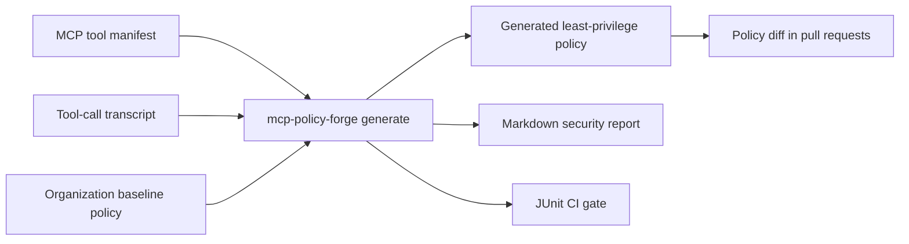

# Showcase / 展示

## 中文

`mcp-policy-forge` 的核心价值是把 MCP 工具权限从“口头约定”变成可审计、可 diff、可接入 CI 的文件。



## 30 秒场景

你准备发布一个 MCP server。它暴露了这些工具：

- `repo.read_file`
- `repo.apply_patch`
- `web.fetch`
- `shell.run`

你保存了一段代表性 transcript：

```json
{"type":"tool_call","name":"repo.read_file","arguments":{"path":"README.md"}}
{"type":"tool_call","name":"repo.apply_patch","arguments":{"target_path":"src/app.py"}}
{"type":"tool_call","name":"web.fetch","arguments":{"url":"https://docs.example.com/index.html"}}
{"type":"tool_call","name":"shell.run","arguments":{"command":"python -m unittest","cwd":"."}}
```

运行：

```bash
mcp-policy-forge generate \
  --manifest examples/manifest.json \
  --transcript examples/transcript.jsonl \
  --org-policy examples/org-policy.json \
  --repo-root . \
  --out-policy reports/policy.generated.json \
  --out-summary reports/summary.md \
  --out-md reports/report.md \
  --junit reports/junit.xml
```

得到的策略会显式写出：

```json
{
  "effect": "allow",
  "tools": ["repo.apply_patch"],
  "actions": ["write_file", "read_file"],
  "paths": ["src/app.py"],
  "reason": "Generated from manifest/transcript least-privilege inference"
}
```

同时也会保留组织基线：

```json
{
  "effect": "deny",
  "tools": ["shell.*"],
  "actions": ["secret_access"],
  "reason": "Shell tools must not receive raw secrets"
}
```

`reports/summary.md` 适合直接写入 GitHub Actions summary 或 PR 评论：

```bash
cat reports/summary.md >> "$GITHUB_STEP_SUMMARY"
gh pr comment 123 --body-file reports/summary.md
```

## PR 里看 diff

```bash
mcp-policy-forge diff \
  --old examples/org-policy.json \
  --new reports/policy.generated.json \
  --out-md reports/policy-diff.md
```

可读 diff 摘要：

```text
Added rules
- allow repo.apply_patch actions=[write_file, read_file] paths=[src/app.py]
- allow repo.read_file actions=[read_file] paths=[src/app.py, README.md]
- allow shell.run actions=[execute_command, read_file] paths=[.]
- allow web.fetch actions=[network] networks=[docs.example.com]
```

这让 reviewer 可以直接问：

- `shell.run` 是否真的需要在仓库根目录执行命令？
- `repo.apply_patch` 是否只能写 `src/app.py`，还是需要更窄的文件范围？
- `web.fetch` 是否只允许文档域名？
- deny baseline 是否覆盖 raw secret 进入 shell 的风险？

## English

`mcp-policy-forge` turns MCP tool permissions into auditable, diffable, CI-ready policy files.

It combines a tool manifest, representative tool-call transcripts, and an organization baseline policy, then emits:

- a generated least-privilege policy,
- a Markdown security report,
- a JUnit CI gate,
- and a policy diff for pull requests.

The highest-signal workflow is:

```bash
mcp-policy-forge generate \
  --manifest examples/manifest.json \
  --transcript examples/transcript.jsonl \
  --org-policy examples/org-policy.json \
  --repo-root . \
  --out-policy reports/policy.generated.json \
  --out-summary reports/summary.md \
  --out-md reports/report.md \
  --junit reports/junit.xml

mcp-policy-forge diff \
  --old examples/org-policy.json \
  --new reports/policy.generated.json \
  --out-md reports/policy-diff.md
```

Use the diff in code review to discuss new file writes, command execution, network domains, and secret-handling deny rules.

Use `reports/summary.md` as a GitHub Actions summary or PR comment when reviewers need a compact READY/REVIEW/BLOCK decision with the full generated policy hidden in an expandable details block.
